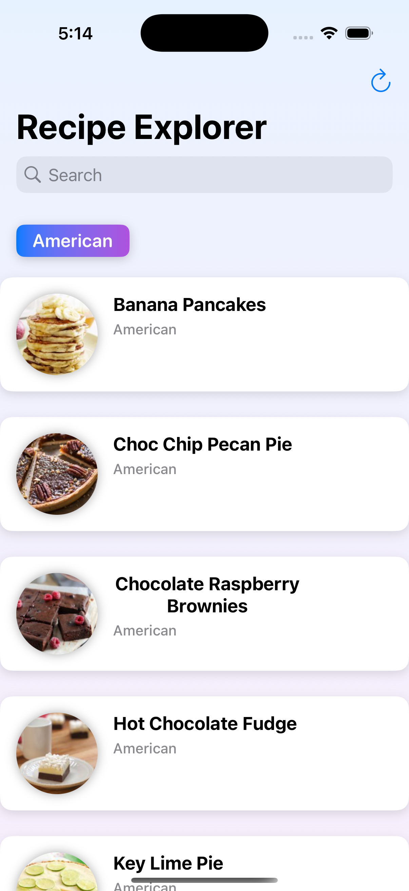
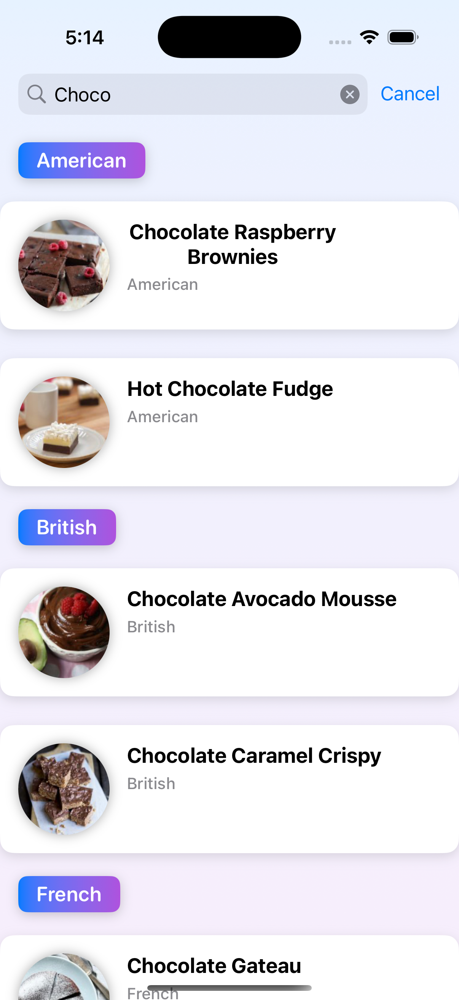
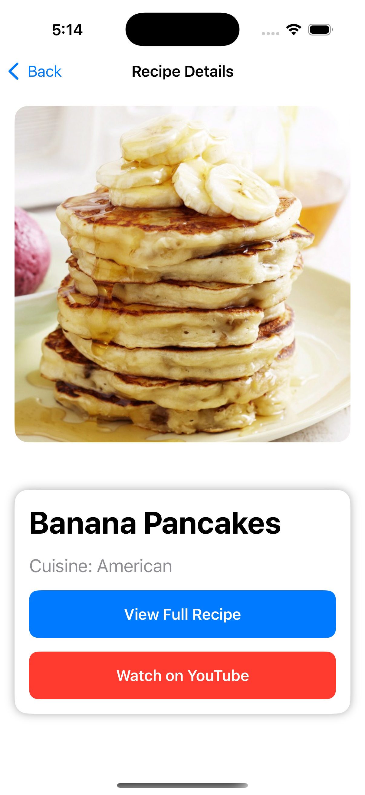

# Recipe Explorer

Recipe Explorer is a SwiftUI-based iOS application designed to display recipes fetched from an API endpoint. The app showcases recipes categorized by cuisine, allowing users to view details like the recipe name, photo, and cuisine type. It includes modern Swift features like concurrency (`async/await`), custom image caching, and comprehensive error handling.

---

## Features

- **Recipe List**: Displays a list of recipes categorized by cuisine.
- **Detail View**: View more details about each recipe, including the name, photo, and cuisine type.
- **Pull to Refresh**: Users can refresh the recipe list anytime.
- **Error Handling**:
  - Handles empty data, malformed data, and API failures gracefully.
  - Displays user-friendly error messages.
- **Image Caching**: Efficiently caches images to disk to reduce network usage.
- **Swift Concurrency**: Uses `async/await` for asynchronous operations like API calls and image fetching.
- **Unit Testing**: Includes tests for core logic, such as data fetching, error handling, and image loading.

---

## Summary

Recipe Explorer is a clean, production-ready iOS app built using SwiftUI. The app interacts with a remote API to fetch recipes and provides an intuitive, user-friendly interface to explore these recipes. It is optimized for performance with efficient network handling and custom caching. The app gracefully handles errors, making it robust and reliable.

Screenshots:

### Home Page

### Search Functionality

### Detailed View: Image

---

## Focus Areas

- **API Integration**: Prioritized robust handling of API responses, including empty and malformed data.
- **Performance Optimization**: Focused on efficient image caching to reduce network usage.
- **User Experience**: Designed a clean and responsive interface using SwiftUI.
- **Testing**: Ensured comprehensive unit tests for core app functionality.

---

## Time Spent

The project took approximately **5-6 hours**, allocated as follows:
- **Core functionality**: 2 hours
- **UI development**: 1 hours
- **Unit testing**: 1 hours
- **Documentation and polishing**: 1-2 hours

---

## Trade-offs and Decisions

- **Custom Image Caching**: A custom caching mechanism was implemented for better control instead of relying on `URLSession`’s default caching.
- **Focus on Unit Testing**: Prioritized unit tests over integration tests due to time constraints.
- **Static API Endpoints**: Hardcoded API URLs for simplicity in this project.

---

## Weakest Part of the Project

- **Scalability**: The app currently supports only one API endpoint structure. Future versions could dynamically handle multiple APIs or endpoints.
- **UI Animations**: The UI could benefit from smoother animations and transitions to enhance the user experience further.

---

## Technical Requirements Fulfilled

1. **Swift Concurrency**: The app leverages `async/await` for all asynchronous operations.
2. **No External Dependencies**: Built entirely using Apple’s frameworks (`SwiftUI`, `URLSession`, `Combine`).
3. **Efficient Network Usage**:
   - Images are loaded only when needed.
   - Custom caching minimizes repeated network requests.
4. **Testing**:
   - Comprehensive unit tests for data fetching, caching, and error handling.
   - Covered various scenarios such as API success, failure, empty data, and malformed JSON.
5. **SwiftUI Interface**: Designed the UI entirely using SwiftUI to ensure modern design practices.

---

## API Endpoints

The app fetches recipes from the following API endpoints:

- **All Recipes**: [https://d3jbb8n5wk0qxi.cloudfront.net/recipes.json](https://d3jbb8n5wk0qxi.cloudfront.net/recipes.json)
- **Malformed Data**: [https://d3jbb8n5wk0qxi.cloudfront.net/recipes-malformed.json](https://d3jbb8n5wk0qxi.cloudfront.net/recipes-malformed.json)
- **Empty Data**: [https://d3jbb8n5wk0qxi.cloudfront.net/recipes-empty.json](https://d3jbb8n5wk0qxi.cloudfront.net/recipes-empty.json)

---
